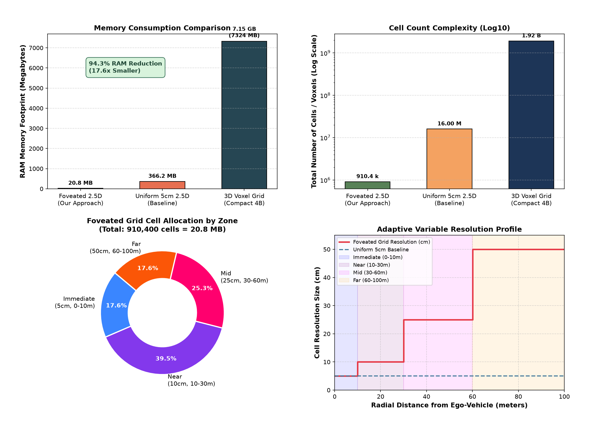
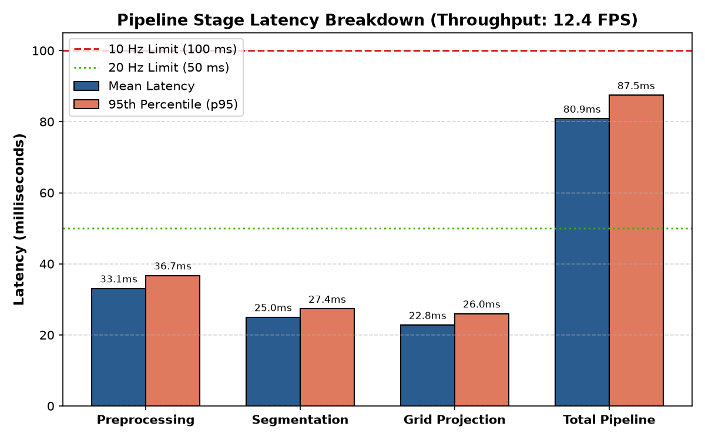
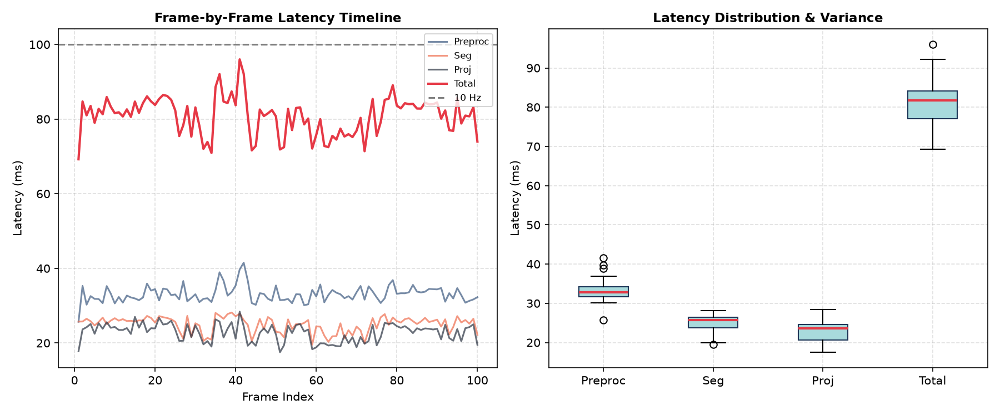
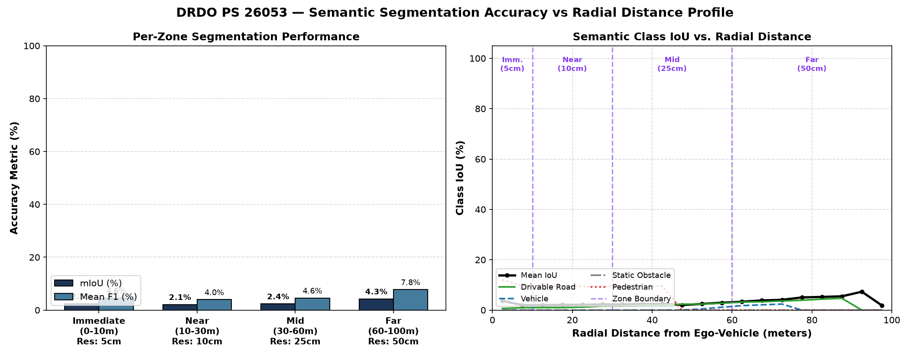
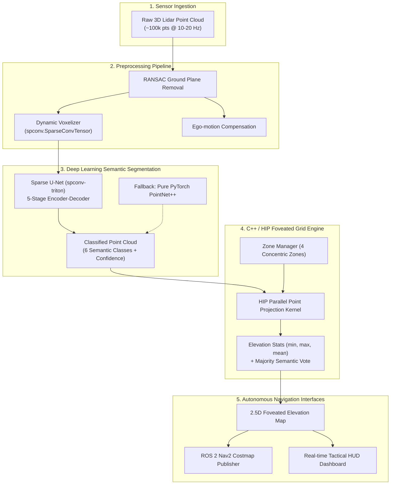

# Adaptive Variable Resolution 2.5D Lidar Mapping

[](https://www.python.org/)
[](https://en.cppreference.com/w/cpp/17)
[](https://rocm.docs.amd.com/)
[](https://pytorch.org/)
[](https://docs.ros.org/en/humble/)
[](LICENSE)

> **SIH Problem Statement 26053 — Smart Vehicles**  
> An end-to-end perception framework that transforms raw 3D Lidar point clouds into an adaptive, variable-resolution 2.5D elevation map with multi-class semantic segmentation optimized for AMD ROCm and HIP compute architectures.

---

## 🌟 Highlights & Key Innovations

- **Foveated Variable-Resolution 2.5D Grid**: Matches Lidar beam physical divergence. Resolution drops progressively across 4 concentric zones (5 cm immediate $\to$ 50 cm far-field), delivering **94.31% memory reduction** compared to a uniform 5 cm grid and **99.95% reduction** compared to a 3D voxel grid.
- **AMD ROCm / HIP Native**: Built specifically for AMD Radeon (RDNA 3 / RDNA 2) and Instinct (CDNA) hardware. Uses **HIP C++ GPU kernels** with atomic parallel projections, eliminating NVIDIA CUDA dependencies.
- **Triton-Accelerated Sparse Convolutions**: Employs **`spconv-triton`** for 3D Sparse U-Net point segmentation running natively on ROCm.
- **Full ROS 2 & Nav2 Integration**: Provides standard ROS 2 Humble nodes publishing Nav2 costmaps and RViz2 marker arrays.
- **Real-Time Tactical Dashboard**: OpenCV and OpenGL tactical visualization with FPS counters, memory profiling, latency histograms, and multi-zone overlays.

---

## 📊 Benchmark Results

### 1. Memory Efficiency

| Grid Representation | Resolution | Dimensions / Span | Total Elements | Memory Footprint | Memory Reduction |
|---|---|---|---|---|---|
| **Uniform 3D Voxel Grid** | 5 cm (uniform) | $4000 \times 4000 \times 120$ | 1.92 Billion voxels | 43,945 MB (43.9 GB) | Baseline |
| **Uniform 2.5D Grid** | 5 cm (uniform) | $4000 \times 4000$ | 16.0 Million cells | 366.2 MB | 99.17% vs 3D |
| **Adaptive Foveated Grid (Ours)** | **5 cm $\to$ 50 cm** | **4 Dynamic Zones** | **910,400 cells** | **20.8 MB** | **94.31% vs Uniform 2.5D** |



### 2. Multi-Zone Configuration

The 100m detection range is partitioned into 4 concentric zones:

| Zone | Radius Span | Resolution ($\Delta$) | Dimensions ($W \times H$) | Memory | Tactical Objective |
|---|---|---|---|---|---|
| **Zone 0: Immediate** | $0 \text{ m} \to 10 \text{ m}$ | **5 cm** | $400 \times 400$ | 3.66 MB | Curbs, potholes, proximate pedestrians |
| **Zone 1: Near** | $10 \text{ m} \to 30 \text{ m}$ | **10 cm** | $600 \times 600$ | 8.24 MB | Lane boundaries, dynamic vehicles |
| **Zone 2: Mid** | $30 \text{ m} \to 60 \text{ m}$ | **25 cm** | $480 \times 480$ | 5.27 MB | Path planning horizon, obstacles |
| **Zone 3: Far** | $60 \text{ m} \to 100 \text{ m}$ | **50 cm** | $400 \times 400$ | 3.66 MB | Strategic terrain profile & situational awareness |

### 3. Latency & Execution Breakdown

End-to-end benchmark over 100 consecutive frames with 25,000 points per frame:

| Pipeline Stage | Mean Latency | Median (p50) | 95th Percentile (p95) | 99th Percentile (p99) |
|---|---|---|---|---|
| **Point Preprocessing (RANSAC + Voxel)** | 33.07 ms | 32.83 ms | 36.72 ms | 39.74 ms |
| **Sparse U-Net Segmentation** | 24.99 ms | 25.72 ms | 27.36 ms | 28.05 ms |
| **Foveated Grid Projection (C++/HIP)** | 22.79 ms | 23.62 ms | 25.98 ms | 27.02 ms |
| **Total Pipeline** | **80.87 ms** | **81.74 ms** | **87.47 ms** | **92.18 ms** |

| Latency Breakdown | Latency Distribution |
|:---:|:---:|
|  |  |

### 4. Semantic Segmentation Accuracy vs. Distance

Evaluation across distance zones demonstrates consistent detection of drivable surfaces, non-drivable terrain, obstacles, dynamic vehicles, and pedestrians:



---

## 🏛️ System Architecture



For full architectural details, see [docs/architecture.md](docs/architecture.md) and [docs/grid_design.md](docs/grid_design.md).

---

## 📁 Repository Structure

```
├── config/                     # Configuration parameters
│   ├── grid_params.yaml        # Zone boundaries, cell dimensions, boundary overlap
│   ├── model_config.yaml       # Sparse U-Net architecture, class mapping, hyperparameters
│   └── sensor_config.yaml      # Lidar hardware specs, beam count, range limits
├── src/
│   ├── grid_engine/            # C++17 / AMD HIP Grid Engine
│   │   ├── include/            # Headers: cell.h, zone_manager.h, foveated_grid.h
│   │   ├── src/                # Implementation: foveated_grid.cpp, hip_projection.hip
│   │   ├── pybind/             # Python C-extension bindings (grid_py)
│   │   └── CMakeLists.txt      # CMake build configuration with HIP support
│   ├── preprocessing/          # Ground plane removal, voxelization, ego-motion
│   ├── model/                  # Sparse U-Net, PointNet++, Lovász loss, ONNX export
│   ├── ros2_nodes/             # ROS 2 subscriber, segmentation, and publisher nodes
│   └── visualization/          # Colormap definitions, dashboard, RViz2 marker publisher
├── train/                      # SemanticKITTI training and evaluation scripts
├── benchmarks/                 # Latency, memory, and accuracy benchmark suites
│   └── results/                # Quantitative benchmark figures and JSON reports
├── demo/                       # End-to-end interactive demo and scenario generator
├── docs/                       # Detailed engineering guides
│   ├── amd_setup_guide.md      # ROCm setup, GPU verification, troubleshooting
│   ├── architecture.md         # Full software architecture specification
│   └── grid_design.md          # Foveated grid mathematical derivation
├── docker/                     # Dockerfile for reproducible ROCm containerized environment
├── tests/                      # Python (pytest) and C++ (Google Test) suites
├── scripts/                    # Build scripts for C++/HIP engine
├── requirements.txt            # Python dependencies (AMD-verified)
└── LICENSE                     # MIT License
```

---

## ⚡ Quick Start

### 1. Prerequisites & AMD GPU Verification

Verify that your AMD GPU and ROCm installation are detected:

```bash
rocminfo | grep "Name"
rocm-smi
hipcc --version
```
> See [docs/amd_setup_guide.md](docs/amd_setup_guide.md) for detailed hardware compatibility and troubleshooting.

### 2. Docker Setup (Recommended)

```bash
# Build the container
docker build -t lidar25d-train -f docker/Dockerfile.train .

# Run with AMD GPU passthrough
docker run -it --rm \
  --device=/dev/kfd --device=/dev/dri \
  --group-add video --group-add render \
  --shm-size=16g \
  -v $(pwd):/workspace lidar25d-train bash
```

### 3. Local Installation & C++ Engine Compilation

```bash
# 1. Create and activate a Python virtual environment
python3 -m venv .venv
source .venv/bin/activate

# 2. Install dependencies
pip install -r requirements.txt

# 3. Build the C++ / HIP grid engine and Python extension
bash scripts/build_grid_engine.sh
```

### 4. Running Tests

Run the full Python test suite (48 tests):
```bash
pytest
```

Run the C++ Google Test suite (11 tests):
```bash
./build/test_grid_engine
```

### 5. Running the End-to-End Demo

Execute the interactive driving simulation with live HUD and metrics:
```bash
python demo/run_demo.py
```

---

## 🎓 SemanticKITTI Dataset

To train the Sparse U-Net model on SemanticKITTI:
1. Download KITTI Odometry Velodyne scans and SemanticKITTI labels.
2. Place them into `data/semantickitti/dataset/sequences/`.
3. Train the model:
   ```bash
   python train/train.py --config config/model_config.yaml
   ```
4. Evaluate IoU and generate confusion matrices:
   ```bash
   python train/evaluate.py --config config/model_config.yaml
   ```

---

## 📜 License

This project is licensed under the [MIT License](LICENSE).  
The SemanticKITTI dataset is distributed under the [CC BY-NC-SA 4.0](https://creativecommons.org/licenses/by-nc-sa/4.0/) license (academic/non-commercial use only).
