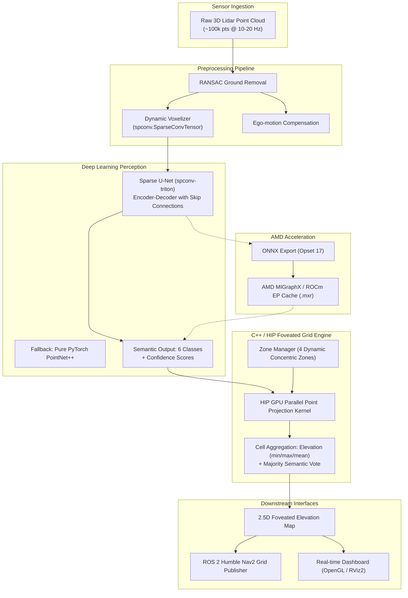

# System Architecture

Adaptive Variable Resolution 2.5D Lidar Mapping is an end-to-end perception framework designed for autonomous vehicles operating on AMD ROCm compute hardware.

---

## Pipeline Components

### 1. Point Cloud Preprocessing (`src/preprocessing/`)
- **Ground Removal**: RANSAC plane segmentation filters ground returns to isolate obstacles and terrain profiles.
- **Voxelization**: Quantizes points into sparse coordinates compatible with sparse tensor engines.
- **Ego-motion Compensation**: Applies vehicle velocity and yaw rate transforms across scan sweeps.

### 2. Semantic Segmentation (`src/model/`)
- **Sparse U-Net**: Primary model based on `spconv-triton`. Employs 5 encoder-decoder stages with SubMConv3d and SparseConv3d blocks.
- **PointNet++**: Pure PyTorch fallback requiring zero custom CUDA/C++ extensions, guaranteeing native ROCm execution out-of-the-box.
- **Taxonomy (6 Classes)**:
  0. Drivable Surface (roads, flat ground)
  1. Non-Drivable Terrain (vegetation, curbs, rough terrain)
  2. Static Obstacles (buildings, poles, walls, trees)
  3. Dynamic Vehicles (cars, trucks, buses, cyclists)
  4. Pedestrians & Vulnerable Road Users
  5. Unknown / Sensor Noise

### 3. Foveated Variable-Resolution Grid Engine (`src/grid_engine/`)
- Implemented in C++17 with AMD HIP GPU kernels for high-throughput parallel projection.
- Points are projected onto a concentric multi-zone polar-cartesian grid:
  - **Zone 0 (0–10m)**: 5 cm resolution (critical near-field safety)
  - **Zone 1 (10–30m)**: 10 cm resolution (immediate trajectory planning)
  - **Zone 2 (30–60m)**: 20 cm resolution (lookahead navigation)
  - **Zone 3 (60–100m)**: 50 cm resolution (far-field situational awareness)
- **Cell Structure**: 32-byte cache-aligned representation storing min/max/mean elevation, point count, occupancy probability, semantic class ID, and confidence.
- Delivers over **94% memory reduction** compared to uniform high-resolution grids.

### 4. ROS 2 Integration & Visualization (`src/ros2_nodes/`, `src/visualization/`)
- ROS 2 Humble nodes for subscribing to sensor streams (`sensor_msgs/PointCloud2`) and publishing Nav2-ready costmaps and RViz2 marker arrays.
- Interactive multi-panel tactical dashboard displaying the top-down 2.5D elevation map, semantic overlays, frame rate, latency breakdown, and memory statistics.
